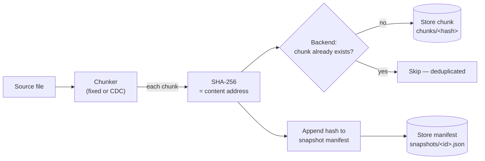
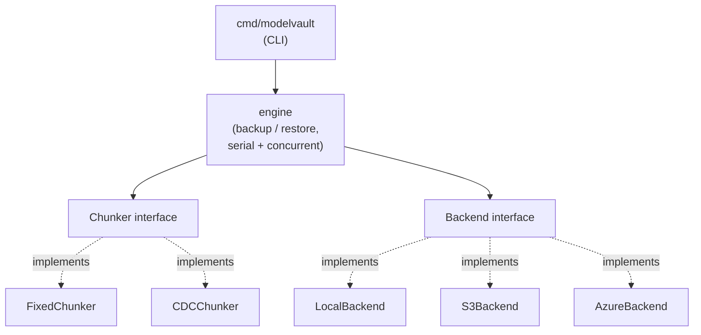

# modelvault

**Content-addressed, deduplicated, cross-cloud backup & restore for ML model artifacts — written in Go.**

modelvault splits a file into chunks, addresses each chunk by its SHA-256 hash, and
stores every unique chunk exactly once. Backing up a file that shares data with an
earlier backup stores only what actually changed. A snapshot is an ordered list of
chunk hashes, so any backup restores byte-for-byte — and every chunk is re-verified
against its hash on the way out, so silent corruption is caught on restore. The same
binary backs up to local disk, **AWS S3**, or **Azure Blob Storage**.

> **Status:** Phases 1–4 complete. A content-addressed backup/restore engine with
> deduplication, two chunking strategies (fixed-size and content-defined), a concurrent
> backup/restore pipeline with cancellation, and three storage backends (local disk, S3,
> Azure Blob) behind one interface. A service layer (REST API, Prometheus metrics,
> container/K8s deployment) is next on the [roadmap](ROADMAP.md).

---

## Why

ML model artifacts are large binary files that change *incrementally* — a fine-tuned
checkpoint differs from its base by a fraction of its bytes. Storing each version in
full is wasteful. modelvault stores only the chunks that changed between versions, so
keeping a full history of a model is cheap. Because each chunk is addressed by its own
hash, integrity is verifiable end-to-end — useful wherever model provenance and
tamper-evidence matter. And because storage sits behind one interface, the same backup
can target local disk or either major cloud.

---

## How it works



**Backup:** read the file → split into chunks → hash each chunk → store it only if the
backend doesn't already have that hash → record the ordered hash list as a snapshot.

**Restore:** read the snapshot → fetch each chunk by hash → verify its hash → write the
bytes in order. The result is identical to the original, or restore fails loudly.

---

## Design

The engine depends only on two interfaces — `Chunker` and `Backend` — so chunking
strategies and storage backends are swappable without touching the core logic. Adding
S3 and Azure was one new file each, with **zero changes to the engine**.



`context.Context` is threaded from the CLI through the engine to every storage call, so
a cancelled backup (Ctrl+C) aborts in-flight cloud operations. The concurrent pipeline
(fan-out hashing, bounded store pool, ordered collector) is coordinated with `errgroup`
and verified race-free with Go's race detector.

---

## Measured results

**Deduplication (fixed vs content-defined chunking).** Insert 200 bytes near the front
of a 1 MiB file and back it up again:

| strategy    | chunks | chunks re-stored | reuse  |
|-------------|-------:|-----------------:|-------:|
| fixed-4096  |    257 |              257 |   0.0% |
| cdc-avg4096 |    209 |                1 |  99.5% |

**Concurrency (serial vs pipelined backup, 8 MiB, in-memory backend):** 584 MB/s → 894
MB/s, a **1.53× speedup**.

Both reproduce from tests in this repo; full details in [METRICS.md](METRICS.md).

---

## Install & build

```bash
git clone https://github.com/Arjun7114/modelvault.git
cd modelvault
go build -o modelvault.exe ./cmd/modelvault   # Windows
# go build -o modelvault ./cmd/modelvault     # macOS / Linux
```

---

## Usage

```bash
# Local disk
modelvault backup --chunker cdc model.bin
modelvault list
modelvault restore --out restored.bin <snapshot-id>

# AWS S3
modelvault backup --backend s3 --bucket my-bucket --region ap-south-1 model.bin

# Azure Blob (reads AZURE_STORAGE_CONNECTION_STRING from the environment)
modelvault backup --backend azure --container modelvault model.bin
```

Flags: `--backend local|s3|azure`, `--vault DIR`, `--bucket`, `--region`, `--container`,
`--chunker fixed|cdc`, `--chunk-size N`. On Windows, invoke the built binary as
`.\modelvault.exe`.

---

## Project layout

```
cmd/modelvault/     CLI entrypoint (parses flags, selects backend, calls the engine)
internal/
  chunker/          Chunker interface + fixed-size and content-defined implementations
  backend/          Backend interface + local, S3, and Azure implementations
  snapshot/         Snapshot manifest type
  engine/           Backup/restore logic: chunk -> hash -> dedup -> store (serial + concurrent)
```

---

## Tests

```bash
go test ./...                 # unit tests (cloud integration tests skip without creds)
go test -race ./internal/engine   # concurrency, race-checked
```

Cloud integration tests run when their credentials are set:
`MODELVAULT_S3_BUCKET` for S3, `AZURE_STORAGE_CONNECTION_STRING` for Azure.

---

## Roadmap

See [ROADMAP.md](ROADMAP.md). Completed: local MVP (Phase 1), content-defined chunking
(Phase 2), concurrent pipeline (Phase 3), and cross-cloud backends — local, S3, Azure
(Phase 4). Next: a service layer with a REST API, Prometheus metrics, and
container/Kubernetes deployment.