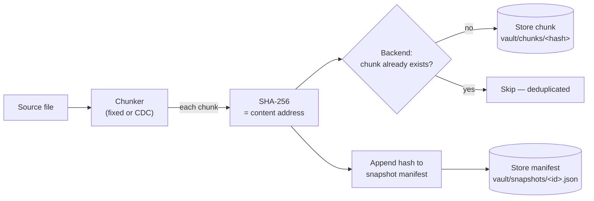
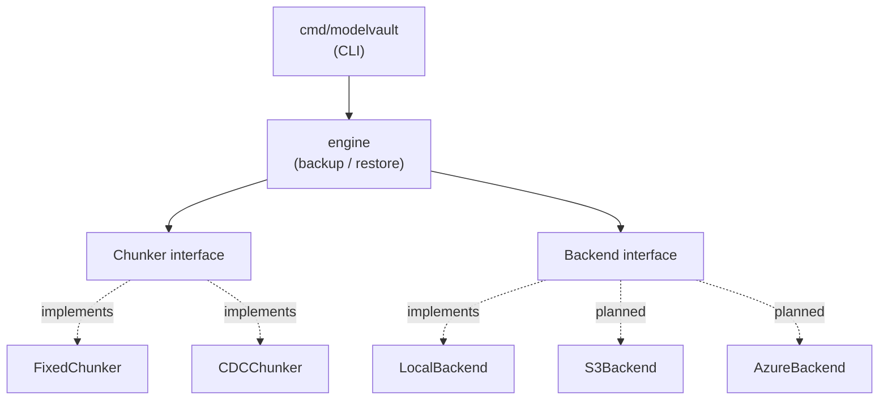

# modelvault

**Content-addressed, deduplicated backup & restore for ML model artifacts — written in Go.**

modelvault splits a file into chunks, addresses each chunk by its SHA-256 hash, and
stores every unique chunk exactly once. Backing up a file that shares data with an
earlier backup stores only what actually changed. A snapshot is an ordered list of
chunk hashes, so any backup restores byte-for-byte — and every chunk is re-verified
against its hash on the way out, so silent corruption is caught on restore.

> **Status:** Phases 1–2 complete. A working local backup/restore engine with
> content-addressed deduplication and two chunking strategies (fixed-size and
> content-defined). A concurrent backup pipeline, cloud backends (S3 / Azure Blob),
> and a service layer are on the [roadmap](ROADMAP.md).

---

## Why

ML model artifacts are large binary files that change *incrementally* — a fine-tuned
checkpoint differs from its base by a fraction of its bytes. Storing each version in
full is wasteful. modelvault stores only the chunks that changed between versions, so
keeping a full history of a model is cheap. Because each chunk is addressed by its own
hash, integrity is verifiable end-to-end — useful wherever model provenance and
tamper-evidence matter.

---

## How it works



**Backup:** read the file → split into chunks → hash each chunk → store it only if the
backend doesn't already have that hash → record the ordered hash list as a snapshot.

**Restore:** read the snapshot → fetch each chunk by hash → verify its hash → write the
bytes in order. The result is identical to the original, or restore fails loudly.

---

## Design

The engine depends only on two interfaces, so chunking strategies and storage backends
are swappable without touching the core logic. This is what lets the planned cloud
backends drop in behind the same contract the local one already satisfies.



---

## The deduplication win

Insert 200 bytes near the front of a 1 MiB file and back it up again. Fixed-size
chunking re-stores the entire file (every boundary shifts); content-defined chunking
re-stores only the chunk that changed.

| strategy    | chunks | chunks re-stored | reuse  |
|-------------|-------:|-----------------:|-------:|
| fixed-4096  |    257 |              257 |   0.0% |
| cdc-avg4096 |    209 |                1 |  99.5% |

Reproduce: `go test ./internal/chunker -run Comparison -v`. Full details in
[METRICS.md](METRICS.md).

---

## Install & build

```bash
git clone https://github.com/Arjun7114/modelvault.git
cd modelvault
go build -o modelvault.exe ./cmd/modelvault   # Windows
# go build -o modelvault ./cmd/modelvault     # macOS / Linux
```

---

## Usage

```bash
# Back up a file (content-defined chunking)
modelvault backup --chunker cdc --chunk-size 4096 path/to/model.bin

# List snapshots in the vault
modelvault list

# Restore a snapshot to a file
modelvault restore --out restored.bin <snapshot-id>
```

Flags: `--vault DIR` (default `vault`), `--chunker fixed|cdc` (default `fixed`),
`--chunk-size N` (default `4096`). On Windows, invoke the built binary as
`.\modelvault.exe`.

---

## Project layout

```
cmd/modelvault/     CLI entrypoint (thin: parses flags, calls the engine)
internal/
  chunker/          Chunker interface + fixed-size and content-defined implementations
  backend/          Backend interface + local-disk implementation
  snapshot/         Snapshot manifest type
  engine/           Backup/restore logic: chunk -> hash -> dedup -> store
```

---

## Tests

```bash
go test ./...
```

---

## Roadmap

See [ROADMAP.md](ROADMAP.md) for the full phase plan. Completed: local MVP (Phase 1)
and content-defined chunking (Phase 2). Next: a concurrent backup pipeline, then S3 and
Azure Blob backends, then a service layer with metrics and container/K8s deployment.